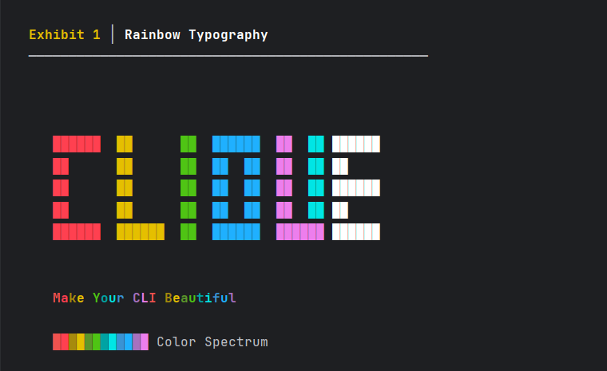

# CLIQUE

A dependency-free mini CLI library for beautifying Java terminal applications.



## Why Clique?

Raw ANSI codes are ugly and hard to read:
```java
System.out.println("\u001B[31m\u001B[1mError:\u001B[0m File not found");
```

Clique makes it clean:
```java
Clique.parser().print("[blue, bold]Clique is awesome![/]");
```

## Quick Start

[](https://jitpack.io/#kusoroadeolu/Clique)

### Maven

```xml
<repositories>
    <repository>
        <id>jitpack.io</id>
        <url>https://jitpack.io</url>
    </repository>
</repositories>

<dependencies>
    <dependency>
        <groupId>com.github.kusoroadeolu</groupId>
        <artifactId>Clique</artifactId>
        <version>v1.2.2</version>
    </dependency>
</dependencies>
```

### Gradle

```gradle
repositories {
    maven { url 'https://jitpack.io' }
}

dependencies {
    implementation 'com.github.kusoroadeolu:Clique:v1.2.2'
}
```

## Features

### Markup Parser
Simple, readable syntax for styled text:
```java
Clique.parser().print("[red, bold]Error:[/] Something went wrong");
```

### Tables
Build beautiful tables with multiple styles:
```java
Clique.table(TableType.DEFAULT)
    .addHeaders("Name", "Age", "Status")
    .addRows("Alice", "25", "Active")
    .addRows("Bob", "30", "Inactive")
    .render();
```

### Boxes
Single-cell boxes with text wrapping:
```java
Clique.box(BoxType.ROUNDED)
    .width(40)
    .content("Your message here")
    .render();
```

### Indenter
Create hierarchical text structures:
```java
Clique.indenter()
    .indent("-")
    .add("Root item")
    .indent("•")
    .add("Nested item")
    .print();
```

### StyleBuilder
Fluent API for building styled strings:
```java
Clique.styleBuilder()
    .append("Success: ", ColorCode.GREEN, StyleCode.BOLD)
    .append("Operation completed", ColorCode.WHITE)
    .print();
```

## Documentation

- **[Full Documentation](docs/)** - Complete guides for all features
- **[Markup Reference](docs/markup-reference.md)** - Colors, styles, and syntax
- **[Examples & Demos](docs/demos.md)** - Interactive examples

## Try the Demos

```bash
git clone https://github.com/kusoroadeolu/Clique.git
cd Clique
javac src/demo/QuizGame.java
java -cp src demo.QuizGame
```

See [docs/demos.md](docs/demos.md) for all available demos.

## License

[Your License Here]

## Contributing

Contributions are welcome! Please feel free to submit a Pull Request.