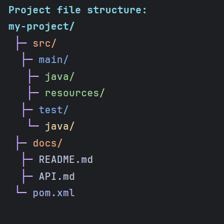

# CLIQUE

A dependency free mini, customizable and extensible CLI library for beautifying Java terminal applications.


## Why Clique?


## Quick Start
[](https://jitpack.io/#kusoroadeolu/Clique)

### Maven

```xml
<repositories>
    <repository>
        <id>jitpack.io</id>
        <url>https://jitpack.io</url>
    </repository>
</repositories>

<dependencies>
    <dependency>
        <groupId>com.github.kusoroadeolu</groupId>
        <artifactId>Clique</artifactId>
        <version>v2.0.0</version>
    </dependency>
</dependencies>
```

### Gradle

```gradle
dependencyResolutionManagement {
	repositoriesMode.set(RepositoriesMode.FAIL_ON_PROJECT_REPOS)
	repositories {
		mavenCentral()
		maven { url 'https://jitpack.io' }
	}
}

dependencies {
    implementation 'com.github.kusoroadeolu:Clique:v2.0.0'
}
```

## Features

### Markup Parser
Simple, readable syntax for styled text:
```java
Clique.parser().print("[red, bold]Error:[/] Something went wrong");
```

### Themes
Drop in popular color schemes with one line:
```java
Clique.registerTheme("catppuccin-mocha");
Clique.parser().print("[ctp_mauve]Styled with Catppuccin![/]");
```
**Built-in themes:** Catppuccin, Dracula, Gruvbox, Nord, Tokyo Night. 
- [Clique Themes Repository](https://github.com/kusoroadeolu/clique-themes)
- [Themes docs](docs/themes.md)
- [Create your own themes](docs/build-your-own-theme.md)

### Tables
Build beautiful tables with multiple styles:
```java
Clique.table(TableType.DEFAULT)
    .addHeaders("Name", "Age", "Status")
    .addRows("Alice", "25", "Active")
    .addRows("Bob", "30", "Inactive")
    .render();
```


### Boxes
Single-cell boxes with text wrapping:
```java
Clique.box(BoxType.ROUNDED)
    .withDimensions(40, 10) //Width, length
    .content("Your message here")
    .render();
```


### Indenter
Create hierarchical text structures:
```java
Clique.indenter()
    .indent("-")
    .add("Root item")
    .indent("•")
    .add("Nested item")
    .print();
```



### StyleBuilder
Fluent API for building styled strings:
```java
Clique.styleBuilder()
    .append("Success: ", ColorCode.GREEN, StyleCode.BOLD)
    .append("Operation completed", ColorCode.WHITE)
    .print();
```

### Progress Bars
Visual feedback for long-running operations:
```java
ProgressBar bar = Clique.progressBar(100);
while (!bar.isDone()) {
    bar.tick();
    bar.render();
    Thread.sleep(50);
}
```


## Documentation

- **[Full Documentation](docs/)** - Complete guides for all features
- **[Markup Reference](docs/markup-reference.md)** - Colors, styles, and syntax
- **[Examples & Demos](https://github.com/kusoroadeolu/clique-demos)** - Interactive examples

## Try the Demos

```bash
git clone https://github.com/kusoroadeolu/clique-demos.git
cd clique-demos
javac src/demo/QuizGame.java
java -cp src demo.QuizGame
```

- See [clique-demos](https://github.com/kusoroadeolu/clique-demos) for all available demos.

## License
Apache 2.0 License

## Contributing
Contributions are welcome! Please feel free to submit a Pull Request.