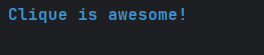

# CLIQUE - README 
## INTRODUCTION 
Clique is my dependency free mini CLI framework aimed at beautifying CLI applications in Java.


## Why Clique?
Raw ANSI codes are ugly and hard to read plus Java doesn't have great CLI tooling for ANSI codes:
```java
System.out.println("\u001B[31m\u001B[1mError:\u001B[0m File not found");
```


Clique makes it clean:
```java
Clique.parser().print("[blue, bold]Clique is awesome![/]");
```



## Setup
[](https://jitpack.io/#kusoroadeolu/Clique)
### Maven

Add JitPack repository to your `pom.xml`:
```xml
<repositories>
    <repository>
        <id>jitpack.io</id>
        <url>https://jitpack.io</url>
    </repository>
</repositories>
```

Then add the Clique dependency:
```xml
<dependencies>
    <dependency>
        <groupId>com.github.kusoroadeolu</groupId>
        <artifactId>Clique</artifactId>
        <version>v1.1.2</version>
    </dependency>
</dependencies>
```

### Gradle

Add JitPack repository to your `build.gradle`:
```gradle
repositories {
    maven { url 'https://jitpack.io' }
}
```

Then add the dependency:
```gradle
dependencies {
    implementation 'com.github.kusoroadeolu:Clique:v1.1.2'
}
```

### Manual JAR Installation

If you prefer not to use a build tool:

1. Clone the repository:
```bash
git clone https://github.com/kusoroadeolu/Clique.git
cd Clique
```

2. Build the JAR:
```bash
javac -d bin src/**/*.java
jar cf clique.jar -C bin .
```

3. Add the JAR to your project's classpath or drop it in your `lib` folder and include it when compiling:
```bash
javac -cp clique.jar YourApp.java
java -cp clique.jar:. YourApp
```

---


## IMPLEMENTATION

### StyleBuilder
Clique uses a fluent builder pattern to chain styled strings with each other. If you enjoy using the builder pattern this is for you
</br> You can append styles to a string using `append()` and print it to the terminal. This resets the terminal style after each append call
```java
Clique.styleBuilder()
      .append("Hello", ColorCode.BLUE, StyleCode.BOLD, StyleCode.UNDERLINE)
      .append("World", ColorCode.RED, StyleCode.DIM , StyleCode.REVERSE_VIDEO)
      .print();    
```


You can append styles to strings using the `stack()` method, but it doesn't reset the terminal style. I added this for more flexibility
```java
Clique.styleBuilder()
      .stack("Hello", ColorCode.BLUE, StyleCode.BOLD, StyleCode.UNDERLINE)
      .stack("World", ColorCode.RED, StyleCode.DIM , StyleCode.REVERSE_VIDEO)
      .print();    
```


You can apply styles to text with `format()`. This method does not reset the terminal style
```java
String styledText = Clique.styleBuilder().format("This text is red", ColorCode.RED);
```

You can apply styles to text with `formatReset()`. This method resets the terminal style

```java
String styledText = Clique.styleBuilder().formatReset("This text is red", ColorCode.RED,StyleCode.BOLD);
```

You can get the styledText after appending strings by using the `get` method
```java
String styledText = Clique.styleBuilder()
        .stack("Hello", ColorCode.BLUE, StyleCode.BOLD, StyleCode.UNDERLINE)
        .stack("World", ColorCode.RED, StyleCode.DIM)
        .get(); 
```

## Parser Methods

### Quick Overview
Clique supports a markup parsing format for less verbose style building

- `AnsiStringParser`. This allows you to parse supported markup strings with default parsing configurations i.e. lenient parsing, a default delimiter and tags are

```java
String str = "[red, bold]Hello [blue, ul]World";
AnsiStringParser parser = Clique.parser(); 
parser.print(str); //This will print `Hello` as red and bold, reset and print `World` as blue and underlined
```

- `ParserConfiguration`. This allows you to configure your parser to enable strict parsing, set your custom delimiter or auto close tags

```java
import com.github.kusoroadeolu.parser.configuration.ParserConfiguration;

String str = "[red bold]Hello[blue] World"; //Notice there are no commas as the delimiter here
ParserConfiguration configuration = ParserConfiguration
        .builder()
        .enableAutoCloseTags() //Auto closes tags for you
        .delimiter(' '); //Set the default delimiter to a space
AnsiStringParser configuredParser = Clique.parser()
        .configuration(configuration);


configuredParser.

print(str);
```
Here we can see we set a custom delimiter. This allows for more flexibility for those who don't want to use the default `comma` delimiter


### Basic Parsing
```java
// Parse and return styled string
String styled = Clique.parser().parse("[red, bold]Error:[/] Something went wrong");

// Parse and print directly (convenient shorthand)
Clique.parser().print("[red, bold]Error:[/] Something went wrong");

// Get the original string without markup tags
AnsiStringParser parser = Clique.parser();
parser.parse("[red, bold]Hello[/] World");
String original = parser.getOriginalString(); // Returns "Hello World"
```

### Parser Exceptions
When using strict parsing, Clique can throw two types of exceptions:

**UnidentifiedStyleException** - Thrown when a style doesn't exist:
```java
ParserConfiguration config = ParserConfiguration.builder()
    .enableStrictParsing();
AnsiStringParser parser = Clique.parser().configuration(config);

// This will throw UnidentifiedStyleException because "bol" doesn't exist
parser.parse("[red, bol]Text[/]");
```

**ParseProblemException** - Thrown when tags are malformed:
```java
// Nested brackets cause parsing issues
parser.parse("[[[red]]]Text[/]");
```

Without strict parsing enabled, invalid styles are simply ignored.

## Supported Markup Options
Clique supports **text color**, **background color**, and **text style** tags inside markup strings.

---

### Text Colors

Use standard or bright color names:

| Type | Example | Description |
|------|----------|------------|
| Standard | `red`, `green`, `yellow`, `blue`, `magenta`, `cyan`, `white`, `black` | Basic ANSI text colors |
| Bright | `*red`, `*green`, `*yellow`, `*blue`, `*magenta`, `*cyan`, `*white`, `*black` | Brighter versions of the standard colors |

**Example**
```java
Clique.parser().print("[red, bold]Error:[/] File not found");
Clique.parser().print("[*blue]Bright blue text[/]");
```

---

### Background Colors

Prefix color names with `bg_` for background colors.  
Use `*bg_` for bright backgrounds.

| Type | Example | Description |
|------|----------|-------------|
| Standard | `bg_red`, `bg_blue`, `bg_yellow`, `bg_white` | Standard background colors |
| Bright | `*bg_red`, `*bg_blue`, `*bg_yellow`, `*bg_white` | Bright background colors |

**Example**
```java
Clique.parser().print("[bg_red, white]Alert![/]");
Clique.parser().print("[*bg_blue, *white]Bright background[/]");
```

---

### Text Styles

Clique supports a range of ANSI text effects:

| Style | Tag | Description |
|--------|------|-------------|
| **Bold** | `bold` | Emphasizes text |
| **Dim** | `dim` | Lowers brightness |
| **Italic** | `italic` | Slants the text |
| **Underline** | `ul` | Underlines text |
| **Reverse Video** | `rv` | Swaps foreground/background colors |
| **Invisible Text** | `inv` | Hides text (useful for debugging or tricks) |
| **Reset** | `/` | Resets all styles |

**Example**
```java
Clique.parser().print("[bold, ul]Important[/] [dim]subtle note[/]");
Clique.parser().print("[rv]Inverted colors![/]");
```

---

### Quick Reference

| Category | Example Syntax | Result |
|-----------|----------------|--------|
| Text Color | `[red]Text[/]` | Red text |
| Bright Color | `[*blue]Text[/]` | Bright blue text |
| Background | `[bg_yellow, black]Text[/]` | Black text on yellow background |
| Bright Background | `[*bg_green, white]Text[/]` | White text on bright green background |
| Style | `[bold, ul, red]Text[/]` | Red, bold, and underlined |
| Reset | `[red]Text[/]` | Resets style after closing tag |


## Tables
Tables are a feature of Clique which support structured data. For a brief introduction, there are currently 5 tables
1. Default table 
2. Compact/Minimal table
3. Box Draw table
4. Rounded Box Draw table
5. Markdown table


All of these tables are abstracted behind the table interface and can be accessed using the `Clique` facade.
```java
Table t = Clique.table(TableType.COMPACT);
t.addHeaders("Name", "Age", "Class")
                .addRows("John", "25", "Class A")
                .addRows("Doe", "26", "Class B")
t.render(); //Print the table on the terminal
```


### Table Manipulation
Tables support dynamic updates after creation:
```java
Table table = Clique.table(TableType.DEFAULT)
    .addHeaders("Name", "Age", "Status")
    .addRows("Alice", "25", "Active")
    .addRows("Bob", "30", "Inactive");

// Update a specific cell (row 1, column 2)
table.updateCell(1, 2, "Active");

// Remove a specific cell (replaces with null replacement)
table.removeCell(1, 1);

// Remove an entire row (cannot remove headers at row 0)
table.removeRow(1);

// Get table as string instead of printing
String tableString = table.buildTable();
System.out.println(tableString);
```

### Table Configuration
If you want more stylistic choices for your tables, you can use the `TableConfiguration` class to configure and style your tables
**NOTE:** Markup parsing is enabled by default
```java
BorderStyle style = BorderStyle.builder() 
                .horizontalBorderStyles(ColorCode.CYAN)
                .verticalBorderStyles(ColorCode.MAGENTA)
                .edgeBorderStyles(ColorCode.YELLOW);

TableConfiguration configuration = TableConfiguration
        .builder()
        .columnAlignment(0, CellAlign.LEFT)  //Column alignment will always take precedence over table alignment
        .borderStyle(style) //Style class for styling table borders
        .parser(Clique.parser()); //Set a parser for the table to enable markup formatting for rows
        .alignment(CellAlign.CENTER) //Centers each row's values. Rows are left aligned by default
        .padding(2); //The amount of whitespace added to each value in a cell to avoid cramping

Table t = Clique.table(TableType.MARKDOWN, configuration)
        .addHeaders("[green, bold]Name[/]", "[green, bold]Age[/]", "[green, bold]Class[/]") //Notice the markup, Clique automatically parses this under the hood
        .addRows("[red]John[/]", "25", "Class A")
        .addRows("[red]Doe[/]", "26", "Class B");
t.render();
```

### Null Handling
When cells are null or removed, Clique replaces them with a configurable value:
```java
TableConfiguration config = TableConfiguration.builder()
    .nullReplacement("N/A");  // Default is empty string

Table table = Clique.table(TableType.DEFAULT, config);
table.addHeaders("Name", "Age", "City")
    .addRows("Alice", null, "NYC");  // null becomes "N/A"

table.render();
```

This is especially useful when you have incomplete data or when using `removeCell()`.

---


## Boxes
Boxes are single cell objects which support text wrapping, unlike tables. Boxes are best used to display standalone/long text data
</br> Clique currently has 4 box types.
1. Default box
2. Classic box
3. Rounded box
4. Double line box

All of these boxes are abstracted behind the box interface and can be accessed using the `Clique` facade.

```java
Box box = Clique.box(BoxType.CLASSIC)
        .width(10)
        .length(10)
        .content("This is my first box");
        
box.render(); //Print the box to the terminal
```

### Box Configuration
Box configuration allows for more stylistic choices to your boxes. It defines how boxes are drawn, styled, its content is aligned, and rendered within the terminal.
**NOTE:** Markup parsing is enabled by default

```java
// Define a colorful border style
BorderStyle style = BorderStyle.builder()
     .horizontalBorderStyles(ColorCode.CYAN)
     .verticalBorderStyles(ColorCode.MAGENTA)
     .edgeBorderStyles(ColorCode.YELLOW);

// Build the box configuration
BoxConfiguration config = BoxConfiguration.builder()
     .borderStyle(style) 
     .textAlign(TextAlign.CENTER) //Where the text should be aligned in the box
     .centerPadding(3) //The amount of padding from both sides, when the content of the box is centered
     .autoSize(true) // Will automatically resize the box, if the box cannot wrap around the content
     .parser(Clique.parser()); // A parser is provided by default, but you can pass a customized parser here

Box b = Clique.box(BOX.DOUBLE_LINE)
        .configuration(config)
        .content("[bold, blue]This is a configured box") //This box will be autoAdjusted, no need for a length or width if you don't need it
        .render();
```

### Box Customization
You can customize your box edges and borders. Right now only the `DEFAULT` box can be customized. You can get a customizable box using the `Clique.customizableBox()`
```java
BoxConfiguration config = BoxConfiguration.builder()
        .autoSize(true);

Box b = Clique.customizableBox(BoxType.DEFAULT, config)
        .customizeEdge('<')
        .customizeVerticalLine('~')
        .content("[red]This is my custom box :)");
```


## Indenter
Indenter is a feature that helps you create hierarchical and nested text structures with ease. It's perfect for building tree views, nested lists, file structures, or any content that needs multiple levels of indentation.
The indenter is abstracted behind the indenter interface and can be accessed using the `Clique` facade.

```java
Indenter indenter = Clique.indenter()
        .indent()  // Create first indent level
        .add("Root Level")
        .indent()  // Nest deeper
        .add("Nested Item 1")
        .add("Nested Item 2")
        .unindent()  // Go back up
        .add("Back to Root");

indenter.print();  // Print the indented structure
```

### Basic Usage
The indenter uses a stack-based approach to manage indent levels:
```java
Indenter indenter = Clique.indenter()
        .indent(2, "-")  // Indent 2 spaces with "-" flag
        .add("First item")
        .add("Second item")
        .indent(2, "•")  // Nest deeper with bullet flag
        .add("Nested item")
        .unindent()  // Pop back to previous level
        .add("Back to first level");

indenter.print();
```

### Custom Flags
Flags are the characters/symbols that appear at the start of each indented line. You can use custom flags to create different visual styles:
```java
Indenter indenter = Clique.indenter()
        .indent("-")  // Dash flag
        .add("Item 1")
        .indent("•")  // Bullet flag
        .add("Sub-item")
        .indent("→")  // Arrow flag
        .add("Nested sub-item");

indenter.print();
```

You can also use the `Flag` enum for common flags:
```java
Indenter indenter = Clique.indenter()
        .indent(Flag.BULLET)
        .add("Bullet item")
        .indent(Flag.ARROW)
        .add("Arrow item");
```

### Indenter Configuration
Configure your indenter for more control over spacing, default flags, and styling:
**NOTE:** Markup parsing is enabled by default

```java
IndenterConfiguration config = IndenterConfiguration.builder()
        .indentLevel(4)  // 4 spaces per indent level
        .defaultFlag("→")  // Default flag when none specified
        .parser(Clique.parser());  // Enable markup parsing

Indenter indenter = Clique.indenter()
        .configuration(config)
        .indent()
        .add("[blue, bold]Root[/]")
        .indent()
        .add("[green]Nested item[/]");

indenter.print();
```

### Managing Indent Levels
The indenter provides several methods to control indent depth:
```java
Indenter indenter = Clique.indenter();

// Indent with custom level and flag
indenter.indent(3, "•");  // 3 spaces with bullet

// Indent with just a level (uses default flag)
indenter.indent(2);

// Indent with just a flag (uses default level from config)
indenter.indent("→");

// Indent with no arguments (uses defaults)
indenter.indent();

// Go back up one level
indenter.unindent();

// Reset to zero indentation
indenter.resetLevel();
```

### Adding Content
The indenter supports adding single strings, multiple strings via arrays, collections, or any object at the current indent level:
```java
Indenter indenter = Clique.indenter()
        .indent("-");

// Add single strings
indenter.add("Item 1");
indenter.add("Item 2");

// Add multiple strings at once (varargs)
indenter.add("Item 3", "Item 4", "Item 5");

// Add a collection
List<String> items = Arrays.asList("A", "B", "C");
indenter.add(items);

// Add any object (calls toString())
indenter.add(new Date());

indenter.print();
```

### Getting and Clearing Content
```java
Indenter indenter = Clique.indenter()
        .indent("-")
        .add("Item 1")
        .add("Item 2");

// Get the indented string without printing
String result = indenter.get();
System.out.println(result);

// Clear content but keep indent levels
indenter.clear();

// Clear content AND reset indent levels
indenter.flush();
```

###  Example: File Tree
```java
IndenterConfiguration config = IndenterConfiguration.builder()
        .indentLevel(2);

Indenter tree = Clique.indenter()
        .configuration(config)
        .add("[blue, bold]project/[/]")
        .indent("[magenta]├─ ")
        .add("[yellow]src/[/]")
        .indent()
        .add("com.github.kusoroadeolu.Main.java")
        .add("Utils.java")
        .unindent()
        .add("[yellow]test/[/]")
        .indent()
        .add("MainTest.java")
        .unindent()
        .unindent()
        .indent("[magenta]└─ ")
        .add("README.md");

tree.print();
```


This produces a clean file tree structure with proper indentation and visual hierarchy.

## Additional Examples

### Using StyleBuilder's get() method
```java
// Build styled text without printing
StyleBuilder sb = Clique.styleBuilder();
String styledText = sb
    .append("Success: ", ColorCode.GREEN, StyleCode.BOLD)
    .append("Operation completed", ColorCode.WHITE)
    .get();

// Use the styled text later
System.out.println(styledText);
```

### Customizable Table Shorthand
Customizable tables are tables whose edges, vertical lines and horizontal lines can be modified. Allows you to make crazy tables
</br>Right now only the default table is customizable. Customizable tables can be accessed through the `Clique.customizableTable()` method
```java
TableConfiguration configuration = TableConfiguration
        .builder();

// With configuration
Clique.customizableTable(TableType.DEFAULT, configuration)
    .customizeEdge('*')
    .render();

// Without configuration (uses defaults)
Clique.customizableTable(TableType.DEFAULT)
    .customizeEdge('+')
    .customizeHorizontalLine('=')
    .customizeVerticalLine('|')
    .addHeaders("Col1", "Col2")
    .addRows("A", "B")
    .render();
```

**NOTE:** Emojis will mess with the width calculation for boxes and tables. So try to refrain from using them in tables/boxes


### Terminal Ansi Support
Before applying colors, clique will try to detect if the terminal supports ANSI, if the terminal does, clique will apply ANSI colors
</br> You can also manually force enable ANSI dynamically

```java
Clique.enableCliqueColors(true); // -> Force enables colors regardless of if the terminal supports it
Clique.enableCliqueColors(false); // -> Force disable colors regardless of if the terminal supports it

```


## Try the Demos
Want to see Clique in action? Clone the repo and run the demo applications:
```bash
git clone https://github.com/kusoroadeolu/Clique.git
cd Clique
```

### CLI Art Gallery
An interactive showcase of colors, gradients, ASCII art, and styling possibilities:
```bash
javac src/demo/CliArtGallery.java
java -cp src demo.CliArtGallery
```

### Quiz Game
A colorful Java knowledge quiz with styled tables and real-time scoring:
```bash
javac src/demo/QuizGame.java
java -cp src demo.QuizGame
```

### Code Scanner
Analyze your Java projects with styled output showing file stats, complexity, and TODOs:
```bash
javac src/demo/CodeScanner.java
java -cp src demo.CodeScanner <path-to-your-project>
```

### Project Explorer
Browse file statistics and project structure with beautiful tables:
```bash
javac src/demo/ProjectExplorer.java
java -cp src demo.ProjectExplorer <path-to-your-project>
```

**Note:** These demos [pom.xml](pom.xml)use package-private visibility. If you want to run them separately, you may need to change them to `public class`.


## Features that will not be implemented
- Interactive features


