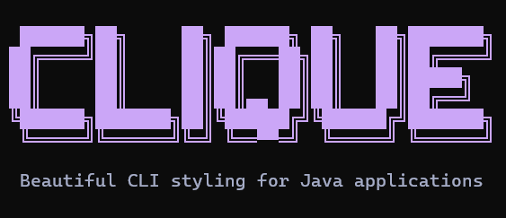
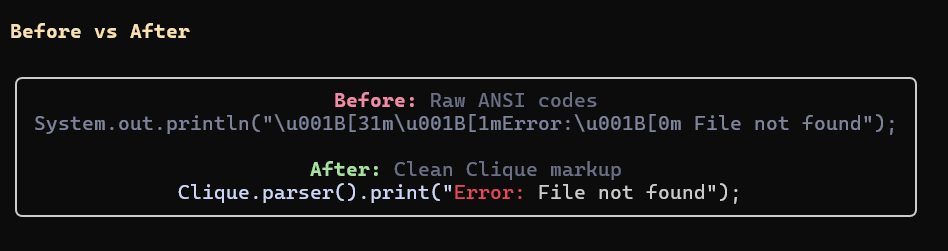
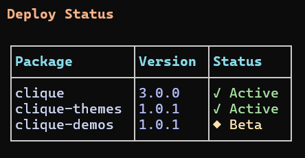
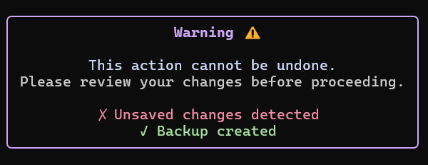
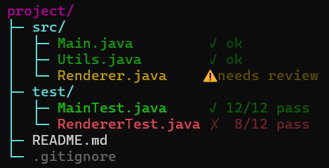
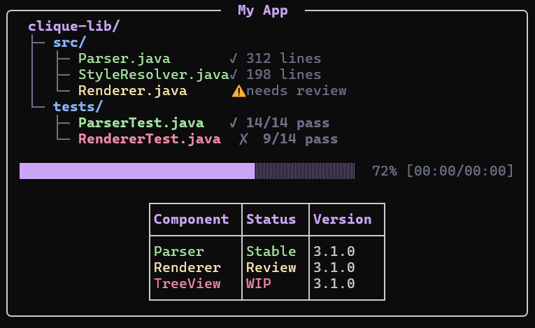
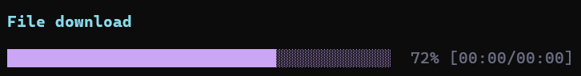

[](https://github.com/kusoroadeolu/Clique/blob/main/LICENSE)

# CLIQUE
A dependency free, lightweight and extensible CLI library for beautifying Java terminal applications.



## Why Clique?



## Quick Start
### Maven

```xml

<dependency>
      <groupId>io.github.kusoroadeolu</groupId>
      <artifactId>clique-core</artifactId>
      <version>3.0.0</version>
</dependency>
```

### Gradle

```gradle
dependencies {
    implementation 'io.github.kusoroadeolu:clique-core:3.0.0'
}
```

## Features

### Markup Parser
Simple, readable syntax for styled text:
```java
Clique.parser().print("[red, bold]Error:[/] Something went wrong");
```

### Themes
Drop in popular color schemes with one line:
```java
Clique.registerTheme("catppuccin-mocha");
Clique.parser().print("[ctp_mauve]Styled with Catppuccin![/]");
```
**Built-in themes:** Catppuccin, Dracula, Gruvbox, Nord, Tokyo Night. 
- [Clique Themes Repository](https://github.com/kusoroadeolu/clique-themes)
- [Themes docs](docs/themes.md)
- [Create your own themes](docs/build-your-own-theme.md)

### Tables
Build beautiful tables with multiple styles:
```java
Clique.table(TableType.DEFAULT)
    .addHeaders("Name", "Age", "Status")
    .addRows("Alice", "25", "Active")
    .addRows("Bob", "30", "Inactive")
    .render();
```



### Boxes
Single-cell boxes with text wrapping:
```java
Clique.box(BoxType.ROUNDED)
    .withDimensions(40, 10) //Width, length
    .content("Your message here")
    .render();
```


### Tree
Display hierarchical data with clean connector lines:
```java
Tree tree = Clique.tree("project/");

Tree src = tree.add("src/");
src.add("Main.java");
src.add("Utils.java");

tree.add("README.md");
tree.print();
```


### Frames
Layout container that vertically stacks nested Clique components inside a border:
```java
Clique.frame()
    .title("[bold]My App[/]")
    .nest(table)
    .nest(progressBar)
    .render();
```



### StyleBuilder
Programmatic API for building styled strings:
```java
Clique.styleBuilder()
    .append("Success: ", ColorCode.GREEN, StyleCode.BOLD)
    .append("Operation completed", Clique.rgb(100, 120, 140))
    .print();
```

### Progress Bars
Visual feedback for long-running operations:
```java
ProgressBar bar = Clique.progressBar(100);
bar.tickAnimated(70);
```


## Documentation

- **[Full Documentation](docs)** - Complete guides for all features
- **[Markup Reference](docs/markup-reference.md)** - Colors, styles, and syntax
- **[Examples & Demos](https://github.com/kusoroadeolu/clique-demos)** - Interactive examples

## Try the Demos

```bash
git clone https://github.com/kusoroadeolu/clique-demos.git
cd clique-demos
javac src/demo/QuizGame.java
java -cp src demo.QuizGame
```

- See [clique-demos](https://github.com/kusoroadeolu/clique-demos) for all available demos.

## License
Apache 2.0 License

## Contributing
Contributions are welcome! Please feel free to submit a Pull Request.