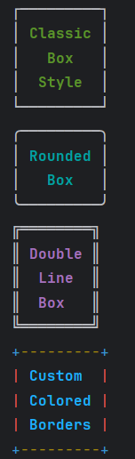

# Boxes

Boxes are single-cell containers that display text with borders. They're perfect for displaying standalone messages, warnings, or long-form text.

## Box Types

Clique provides 4 built-in box styles:

1. **DEFAULT** - Standard box with ASCII borders
2. **CLASSIC** - Classic box style
3. **ROUNDED** - Box with rounded corners
4. **DOUBLE_LINE** - Box with double-line borders



## Basic Usage

### Creating a Simple Box
```java
Box box = Clique.box()
    .withDimensions(10, 20)  // Width, height
    .content("This is my first box");

box.render(); // Print the box to terminal
```

### Box Dimensions

- **Width** - The horizontal size of the box (in characters)
- **Height** - The vertical size of the box (in lines)
```java
Clique.box(BoxType.DEFAULT)
    .withDimensions(50, 5)  // Width, height
    .content("A wider, shorter box")
    .render();
```

### Using Markup in Boxes

Boxes automatically parse markup tags in content:
```java
Clique.box()
    .withDimensions(40, 5)
    .content("[yellow, bold]Warning:[/] This is an important message that needs attention")
    .render();
```

### Multi-line Content

Boxes handle newlines properly and will wrap text accordingly:
```java
Clique.box(BoxType.CLASSIC)
    .withDimensions(40, 10)
    .content(
        """
            [green, bold]Success![/]
            Your operation completed successfully.
            You can now proceed to the next step.
        """
    )
    .render();
```

### Text Alignment

Boxes support a range of text alignments, with the default being centered:
```java
Clique.box(BoxType.CLASSIC)
    .withDimensions(40, 10)
    .content(
        """
            [green, bold]Success![/]
            Your operation completed successfully.
            You can now proceed to the next step.
        """, TextAlign.CENTER
    )
    .render();
```

Available alignments:
- `TextAlign.TOP_LEFT`, `TextAlign.TOP_CENTER`, `TextAlign.TOP_RIGHT`
- `TextAlign.CENTER_LEFT`, `TextAlign.CENTER`, `TextAlign.CENTER_RIGHT`
- `TextAlign.BOTTOM_LEFT`, `TextAlign.BOTTOM_CENTER`, `TextAlign.BOTTOM_RIGHT`

## Box Configuration

Use `BoxConfiguration` to customize box appearance and behavior.

### Basic Configuration
```java
BoxConfiguration config = BoxConfiguration.builder()
    .textAlign(TextAlign.CENTER)
    .autoSize()
    .build();

Clique.box(BoxType.DOUBLE_LINE, config)
    .noDimensions()
    .content("This box auto-sizes to fit content")
    .render();
```

### Configuration Options

#### Text Alignment

Control how content is aligned within the box:
```java
BoxConfiguration config = BoxConfiguration.builder()
    .textAlign(TextAlign.CENTER)
    .build();
```

#### Padding

Shrinks the drawable area by the given number of characters on each side:
```java
BoxConfiguration config = BoxConfiguration.builder()
    .padding(3)
    .build();
```

#### Auto Size

Let the box automatically resize to fit its content:
```java
BoxConfiguration config = BoxConfiguration.builder()
    .autoSize()
    .build();

Clique.box(config)
    .noDimensions()
    .content("This box will size itself")
    .render();
```

When `autoSize` is enabled, the box will automatically adjust dimensions even if the content can't wrap properly.

#### Border Styling

For quick uniform border coloring, pass a `BorderSpec` directly to the factory method — no configuration object needed:
```java
// Static factory
Clique.box(BorderSpec.of("blue"))
    .withDimensions(40, 10)
    .content("Blue border box")
    .render();

// Lambda
Clique.box(() -> "blue")
    .withDimensions(40, 10)
    .content("Blue border box")
    .render();

// With a specific box type
Clique.box(BoxType.CLASSIC, BorderSpec.of("blue"))
    .withDimensions(40, 10)
    .content("Blue border box")
    .render();
```

For per-edge color control, use `BorderStyle` via `BoxConfiguration`:
```java
BorderStyle style = BorderStyle.builder()
    .horizontalStyle("cyan")
    .verticalStyle("magenta")
    .cornerStyle("yellow")
    .build();

BoxConfiguration config = BoxConfiguration.builder()
    .borderStyle(style)
    .build();

Clique.box(BoxType.CLASSIC, config)
    .withDimensions(20, 10)
    .content("Styled Box")
    .render();
```

`BorderStyle` also works directly as a `BorderSpec` for backward compatibility:
```java
Clique.box(BorderStyle.builder().uniformStyle("blue").build())
    .withDimensions(40, 10)
    .content("Blue border box")
    .render();
```

#### Custom Parser

Provide a custom configured parser for markup processing:
```java
ParserConfiguration parserConfig = ParserConfiguration
    .builder()
    .delimiter(' ')
    .build();

BoxConfiguration config = BoxConfiguration.builder()
    .parser(Clique.parser(parserConfig))
    .build();
```

### Full Configuration Example
```java
BoxConfiguration config = BoxConfiguration.builder()
    .borderStyle(BorderSpec.of("blue"))
    .textAlign(TextAlign.CENTER)
    .autoSize()
    .parser(Clique.parser())
    .build();

Clique.box(BoxType.DOUBLE_LINE, config)
    .noDimensions()
    .content("[bold, blue]This is a configured box[/]")
    .render();
```

## Border Char Customization

All box types support custom border characters via `BorderStyle`:
```java
BorderStyle style = BorderStyle.builder()
    .uniformStyle("blue")
    .cornerChar('*')
    .horizontalChar('~')
    .verticalChar('I')
    .build();

Clique.box(style)
    .withDimensions(40, 10)
    .content("[red]This is my custom box :)[/]")
    .render();
```

## Examples

### Alert Box
```java
BoxConfiguration config = BoxConfiguration.builder()
    .textAlign(TextAlign.CENTER)
    .autoSize()
    .build();

Clique.box(BoxType.DOUBLE_LINE, config)
    .noDimensions()
    .content("[red, bold]⚠ ALERT ⚠[/]\n\nSystem maintenance in progress")
    .render();
```

### Info Box
```java
Clique.box(BoxType.ROUNDED)
    .withDimensions(60, 10)
    .content(
        "[blue, bold]ℹ Information[/]\n\n" +
        "This feature is currently in beta. " +
        "Please report any issues you encounter."
    )
    .render();
```

## Things to Watch Out For

- When using `autoSize`, you don't need to specify dimensions — just use `noDimensions()`
- Using `noDimensions()` without an `autoSize` config throws an `IllegalStateException`
- Blank chars for customization are not applied; the previous default char of the `BoxType` is used instead

## See Also

- [Markup Reference](markup-reference.md) - Styling options for box content
- [Parser Documentation](parser.md) - How markup parsing works                                                                                                                                                                                                                                                                                                                                                                                                                                                                                                                                                                                                                                                                                                                                                                                                                                                                                                                                                                                                                                            