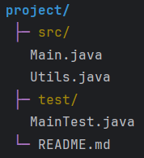

# Indenter

Indenter helps you create hierarchical and nested text structures with ease. It's perfect for building tree views, nested lists, file structures, or any content that needs multiple levels of indentation.

## Basic Usage

### Simple Indentation
```java
Indenter indenter = Clique.indenter()
    .indent()  // Create first indent level
    .add("Root Level")
    .indent()  // Nest deeper
    .add("Nested Item 1")
    .add("Nested Item 2")
    .unindent()  // Go back up
    .add("Back to Root");

indenter.print();  // Print the indented structure
```

### With Custom Flags

Flags are the characters/symbols that appear at the start of each indented line:
```java
Indenter indenter = Clique.indenter()
    .indent(2, "-")  // Indent 2 spaces with "-" flag
    .add("First item")
    .add("Second item")
    .indent(2, "•")  // Nest deeper with bullet flag
    .add("Nested item")
    .unindent()  // Pop back to previous level
    .add("Back to first level");

indenter.print();
```

## Indent Methods

### Indent with Level and Flag
```java
indenter.indent(4, "→");  // 4 spaces with arrow flag
```

### Indent with Just Level
```java
indenter.indent(3);  // 3 spaces, uses default flag
```

### Indent with Just Flag
```java
indenter.indent("•");  // Uses default level from config
```

### Indent with Defaults
```java
indenter.indent();  // Uses both default level and flag
```

## Managing Indent Levels

### Go Back One Level
```java
indenter.unindent();  // Move back up one indent level
```

### Reset to Zero
```java
indenter.resetLevel();  // Reset to 0 indents, does not reset the flag
```

## Adding Content

### Add Single Strings
```java
Indenter indenter = Clique.indenter()
    .indent("-");

indenter.add("Item 1");
indenter.add("Item 2");
```

### Add Multiple Strings (Varargs)
```java
indenter.add("Item 3", "Item 4", "Item 5");
```

### Add a Collection
```java
List<String> items = Arrays.asList("A", "B", "C");
indenter.add(items);
```

### Add Any Object
```java
// Calls toString() on the object
indenter.add(new SomeObject());
indenter.add(42);
```

## Built-in Flags

Use the `Flag` enum for common flag characters:
```java
Indenter indenter = Clique.indenter()
    .indent(Flag.BULLET)   // •
    .add("Bullet item")
    .indent(Flag.ARROW)    // →
    .add("Arrow item")
    .indent(Flag.DASH)     // -
    .add("Dash item");
```

Provided available flags:
- `Flag.BULLET` - `•`
- `Flag.ARROW` - `→`
- `Flag.DASH` - `-`
- `Flag.PLUS` - `+`
- `Flag.ASTERISK` - `*`

## Indenter Configuration

Configure your indenter for more control over spacing, default flags, and styling.

**Note:** Markup parsing is enabled by default.
```java
IndenterConfiguration config = IndenterConfiguration.immutableBuilder()
    .indentLevel(4)       // 4 spaces per indent level
    .defaultFlag("→")     // Default flag when none specified
    .parser(Clique.parser())  // Enable markup parsing
    .build();

Indenter indenter = Clique.indenter(config)
    .indent()
    .add("[blue, bold]Root[/]")
    .indent()
    .add("[green]Nested item[/]");

indenter.print();
```

### Configuration Options

#### Indent Level

Set the number of spaces per indent level:
```java
IndenterConfiguration config = IndenterConfiguration.immutableBuilder()
    .indentLevel(4)  // 4 spaces per level (default is 2)
    .build();
```

#### Default Flag

Set a default flag to use when none is specified:
```java
IndenterConfiguration config = IndenterConfiguration.immutableBuilder()
    .defaultFlag("•")
    .build();

Indenter indenter = Clique.indenter(config)
    .indent()  // Uses "•" as the flag
    .add("Item");
```

#### Custom Parser

Provide a custom configured parser for markup processing:
```java
ParserConfiguration parserConfig = ParserConfiguration
    .immutableBuilder()
    .delimiter(' ')
    .build();

IndenterConfiguration config = IndenterConfiguration.immutableBuilder()
    .parser(Clique.parser().configuration(parserConfig))
    .build();
```

## Getting and Clearing Content

### Get Without Printing
```java
Indenter indenter = Clique.indenter()
    .indent("-")
    .add("Item 1")
    .add("Item 2");

// Get the indented string without printing
String result = indenter.get();
System.out.println(result);
```

### Flush Everything
```java
// Clear content AND reset indent levels
indenter.flush();
```

## Using Markup in Indenter

Indenters automatically parse markup tags:
```java
IndenterConfiguration config = IndenterConfiguration.immutableBuilder()
    .indentLevel(3)
    .build();

Clique.indenter(config)
    .indent("[magenta]├─[/] ")
    .add("[yellow, bold]src/[/]")
    .indent()
    .add("[green]Main.java[/]")
    .add("[green]Utils.java[/]")
    .print();
```

## Examples

### File Tree
```java
IndenterConfiguration config = IndenterConfiguration.immutableBuilder()
    .indentLevel(2)
    .build();

Indenter tree = Clique.indenter(config)
    .add("[blue, bold]project/[/]")
    .indent("[magenta]├─[/] ")
    .add("[yellow]src/[/]")
    .indent()
    .add("com.github.kusoroadeolu.Main.java")
    .add("Utils.java")
    .unindent()
    .add("[yellow]test/[/]")
    .indent()
    .add("MainTest.java")
    .unindent()
    .unindent() 
    .indent("[magenta]└─[/] ")
    .add("README.md");

tree.print();
```



### Task List
```java
Clique.indenter()
    .indent("☐")
    .add("[bold]Project Tasks[/]")
    .indent("  ☐")
    .add("Design phase")
    .add("Development")
    .indent("    ☑")
    .add("[dim, strike]Setup environment[/]")
    .add("[dim, strike]Write tests[/]")
    .unindent()
    .add("Code review")
    .unindent()
    .add("Deployment")
    .print();
```

### Nested Menu
```java
IndenterConfiguration config = IndenterConfiguration.immutableBuilder()
    .indentLevel(3)
    .defaultFlag("▸")
    .build();

Clique.indenter(config)
    .indent()
    .add("[cyan, bold]Main Menu[/]")
    .indent()
    .add("File")
    .indent()
    .add("New")
    .add("Open")
    .add("Save")
    .unindent()
    .add("Edit")
    .indent()
    .add("Cut")
    .add("Copy")
    .add("Paste")
    .unindent()
    .add("View")
    .print();
```

### Hierarchical Data
```java
Clique.indenter()
    .add("[bold]Company Structure[/]")
    .indent("├─")
    .add("[yellow]Engineering[/]")
    .indent("│  ├─")
    .add("Backend Team")
    .add("Frontend Team")
    .unindent()
    .add("[yellow]Design[/]")
    .indent("│  ├─")
    .add("UI/UX Team")
    .add("Graphics Team")
    .unindent()
    .unindent()
    .indent("└─")
    .add("[yellow]Operations[/]")
    .print();
```

## See Also

- [Markup Reference](markup-reference.md) - Styling options for indented content
- [Parser Documentation](parser.md) - How markup parsing works