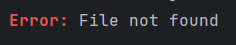

# Parser

Clique's parser allows you to use a simple markup format for styling text instead of verbose `styleBuilder` calls or raw ANSI codes.

## Basic Usage
### Parse and Print
```java
// Parse and print directly
Clique.parser().print("[red, bold]Error:[/] Something went wrong");

// Parse and return styled string
String styled = Clique.parser().parse("[red, bold]Error:[/] Something went wrong");
System.out.println(styled);
```


### Getting the Original String
After parsing, you can retrieve the original text without markup tags:
```java
AnsiStringParser parser = Clique.parser();
parser.parse("[red, bold]Hello[/] World");
String original = parser.getOriginalString("[red, bold]Hello[/] World"); // Returns "Hello World"
```


## Parser Configuration

Customize how the parser behaves using `ParserConfiguration`:
```java
ParserConfiguration configuration = ParserConfiguration
        .immutableBuilder()
        .enableAutoCloseTags()  // Automatically close unclosed tags
        .delimiter(' ')          // Use space instead of comma as delimiter
        .build();

AnsiStringParser configuredParser = Clique.parser(configuration);

// Now you can use space-separated styles
configuredParser.print("[red bold]Hello[blue] World");
```

### Configuration Options

- **`delimiter(char)`** - Set the delimiter between style attributes (default: `,`)
- **`enableAutoCloseTags()`** - Automatically close tags that aren't explicitly closed
- **`enableStrictParsing()`** - Throw exceptions for invalid styles or malformed tags

## Parser Exceptions
When strict parsing is enabled, the parser can throw exceptions for invalid tags:

### UnidentifiedStyleException

Thrown when you use a style that doesn't exist:
```java
ParserConfiguration config = ParserConfiguration.immutableBuilder()
    .enableStrictParsing()
    .build();
    
AnsiStringParser parser = Clique.parser(config);

// This throws UnidentifiedStyleException because "bol" doesn't exist
parser.parse("[red, bol]Text[/]");
```

### ParseProblemException

Thrown when tags are malformed:
```java
// Nested brackets cause parsing issues
parser.parse("[[[red]]]Text[/]");
```

**Note:** Without strict parsing enabled, invalid styles are simply ignored and printed as is

## Escaping Special Characters

Since `[]` brackets are used for markup tags, you need to escape them when displaying literal brackets.

### Escaping Brackets

To display literal brackets, use `[/]` to close the tag interpretation:
```java
// Display literal [123, 456]
Clique.parser().print("[123, 456[/]]");
```

**Pattern:** `[your text with brackets[/]]`

**Examples:**
```java
"[red, bold[/]]"        // Displays: [red, bold]
"[x, y, z[/]]"          // Displays: [x, y, z]
"Coords: [10, 20[/]]"   // Displays: Coords: [10, 20]
```

## Markup Syntax Reference

See [markup-reference.md](markup-reference.md) for a complete list of supported colors, background colors, and text styles.

## Using Parser with Other Features

The parser is integrated into tables, boxes, and indenters. By default, markup parsing is enabled for all of these features:
```java
// Tables with markup
Clique.table(TableType.DEFAULT)
    .addHeaders("[green, bold]Name[/]", "[green, bold]Age[/]")
    .addRows("[red]John[/]", "25")
    .render();

// Boxes with markup
Clique.box(BoxType.ROUNDED)
    .content("[bold, blue]This is a configured box[/]")
    .render();

// Indenter with markup
Clique.indenter()
    .indent()
    .add("[blue, bold]Root[/]")
    .print();
```

You can also pass a custom configured parser to these features through their configuration objects.
