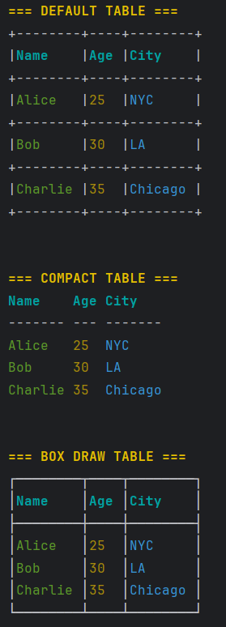

# Tables

Tables help you display structured data in a clean, formatted way. Clique supports multiple table styles with extensive customization options. Tables don't support multi line content

## Table Types

Clique provides 5 built-in table styles:

1. **DEFAULT** - Standard table with ASCII characters
2. **COMPACT** (or **MINIMAL**) - Minimalist table with fewer borders
3. **BOX_DRAW** - Table using box drawing characters
4. **ROUNDED_BOX_DRAW** - Box-draw table with rounded corners
5. **MARKDOWN** - Markdown-style table format



## Basic Usage

### Creating a Simple Table
```java
Table table = Clique.table(TableType.DEFAULT);
table.headers("Name", "Age", "Class")
    .row("John", "25", "Class A")
    .row("Doe", "26", "Class B");

table.render(); // Print the table to terminal
```

## Table Manipulation

Tables support dynamic updates after creation:

### Update a Cell
```java
Table table = Clique.table(TableType.DEFAULT)
    .headers("Name", "Age", "Status")
    .row("Alice", "25", "Active")
    .row("Bob", "30", "Inactive");

// Update a specific cell (row 1, column 2)
table.updateCell(1, 2, "Active");
```

### Remove a Cell
```java
// Remove a specific cell (replaces with null replacement)
table.removeCell(1, 1);
```

### Remove a Row
```java
// Remove an entire row (cannot remove headers at row 0)
table.removeRow(1);
```

### Get Table as String
```java
// Get table as string instead of printing
String tableString = table.get();
System.out.println(tableString);
```

### Using Markup in Tables
Tables automatically parse markup tags when you add content:
```java
Table table = Clique.table(TableType.BOX_DRAW)
    .headers(
        "[cyan, bold]Product[/]",
        "[cyan, bold]Price[/]",
        "[cyan, bold]Stock[/]"
    )
    .row(
        "[yellow]Widget[/]",
        "[green]$19.99[/]",
        "[red, bold]Low[/]"
    )
    .row(
        "[yellow]Gadget[/]",
        "[green]$29.99[/]",
        "In Stock"
    );

table.render();
```

## Table Configuration

Use `TableConfiguration` to customize table appearance and behavior.

**Note:** Markup parsing is enabled by default.

### Basic Configuration
```java
TableConfiguration config = TableConfiguration
    .builder()
    .alignment(CellAlign.CENTER)  // Center all cells
    .padding(2)                    // Add 2 spaces padding
    .build();

Clique.table(TableType.DEFAULT, config)
    .headers("Name", "Age", "Class")
    .row("John", "25", "Class A")
    .render();
```

### Configuration Options

#### Alignment

Control how content is aligned within cells:
```java
TableConfiguration config = TableConfiguration
    .builder()
    .alignment(CellAlign.CENTER)           // Center everything
    .columnAlignment(0, CellAlign.LEFT)    // Column 0 left-aligned
    .columnAlignment(2, CellAlign.RIGHT)   // Column 2 right-aligned
    .build();
```

**Note:** Column alignment always takes precedence over table alignment.

Available alignments:
- `CellAlign.LEFT` - Left-aligned (default)
- `CellAlign.CENTER` - Centered
- `CellAlign.RIGHT` - Right-aligned

#### Padding

Add whitespace around cell content to prevent cramping:
```java
TableConfiguration config = TableConfiguration
    .builder()
    .padding(3)  // 3 spaces on the left/right side, halved on each side if cell is centered
    .build();
```

### Null Handling

When cells are null or removed, Clique replaces them with a configurable value:
```java
TableConfiguration config = TableConfiguration.builder()
    .nullReplacement("N/A")  // Default is empty string
    .build();

TableHeaderBuilder builder = Clique.table(TableType.DEFAULT, config);
builder.headers("Name", "Age", "City")
    .row("Alice", null, "NYC");  // null becomes "N/A"

table.render();
```

#### Border Styling

Style table borders with uniform colors:
**NOTE:** Uniform styling is recommended for tables, due to having more complex layouts than boxes, hence, horizontal/vertical styling might not fully align with each other
```java
BorderStyle style = BorderStyle.builder()
    .uniformStyle("blue")
    .build();

TableConfiguration config = TableConfiguration
    .builder()
    .borderStyle(style)
    .build();

Table table = Clique.table(TableType.BOX_DRAW, config);
```

#### Custom Parser

Provide a custom configured parser for markup processing:
```java
ParserConfiguration parserConfig = ParserConfiguration
    .builder()
    .delimiter(' ')
    .build();

TableConfiguration config = TableConfiguration
    .builder()
    .parser(Clique.parser().configuration(parserConfig))
    .build();
```

### Full Configuration Example
```java
BorderStyle style = BorderStyle.builder()
    .uniformStyle("red")
    .build();

TableConfiguration config = TableConfiguration
    .builder()
    .columnAlignment(0, CellAlign.LEFT) //Overrides table wide alignment
    .borderStyle(style)
    .alignment(CellAlign.CENTER)  //Table Wide alignment
    .padding(1)
    .build();

Table table = Clique.table(TableType.MARKDOWN, config)
    .headers("[green, bold]Name[/]", "[green, bold]Age[/]", "[green, bold]Class[/]")
    .row("[red]John[/]", "25", "Class A")
    .row("[red]Doe[/]", "26", "Class B");

table.render();
```

This is especially useful when you have incomplete data or when using `removeCell()`.

### Basic Customization
```java
BorderStyle style = BorderStyle.builder()
        .horizontalChar('=')
        .verticalChar('|')
        .cornerChar('+')
        .build();

TableConfiguration config = TableConfiguration
        .builder()
        .columnAlignment(0, CellAlign.LEFT) //Overrides table wide alignment
        .borderStyle(style)
        .padding(1)
        .build();

// Without configuration
Clique.table(TableType.DEFAULT, config)
    .headers("A", "B")
    .row("A", "B")
    .render();
```

## Things to Watch Out For
- **Column alignment** always overrides table-wide alignment settings.
- **Customization** Currently, only the `DEFAULT` table type supports customization. Other table types will throw during construction if `BorderStyle#horizontalChar()`, `BorderStyle#verticalChar()`, `BorderStyle#cornerChar()` is passed as a config option.
- Blank chars for customization are not applied, and the previous default char of the `TableType` is used instead


## See Also
- [Markup Reference](markup-reference.md) - Styling options for table content
- [Parser Documentation](parser.md) - How markup parsing works